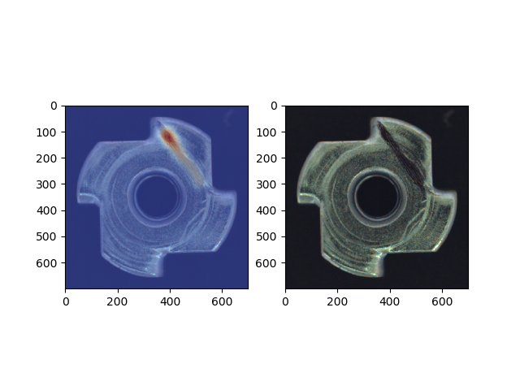

# grad-cam_analysis
Gradient-weighted Class Activation Mapping [1] is a technique which produces visual explanations for decisions made by Convolutional Neural Networks without the need for architectural changes or retraining of the network under inspection.

This code offers a Grad-CAM based analysis for frozen graph models in TensorFlow 1. The heatmaps are displayed together with the original images by default. Also, the results can be saved as images via the flag 'save_images'. More details about important parameters can be found in the comments of the code.

## Example results
Example output for one image of the 'color' class of the metal nuts objects from MVTec AD [2].

## Acknowledgements
Thanks to https://github.com/jacobgil/keras-grad-cam and https://github.com/Ankush96/grad-cam.tensorflow for providing many building blocks for the code.

## References
[1] R. R. Selvaraju et al., “Grad-CAM: Why did you say that? Visual Explanations from Deep Networks via Gradient-based Localization,” CoRR, vol. abs/1610.0, no. 2, pp. 336–359, 2016, doi: 10.1007/s11263-019-01228-7.

[2] P. Bergmann, M. Fauser, D. Sattlegger, and C. Steger, “MVTEC ad-A comprehensive real-world dataset for unsupervised anomaly detection,” in Proceedings of the IEEE Computer Society Conference on Computer Vision and Pattern Recognition, 2019, vol. 2019-June, pp. 9584–9592, doi: 10.1109/CVPR.2019.00982.
